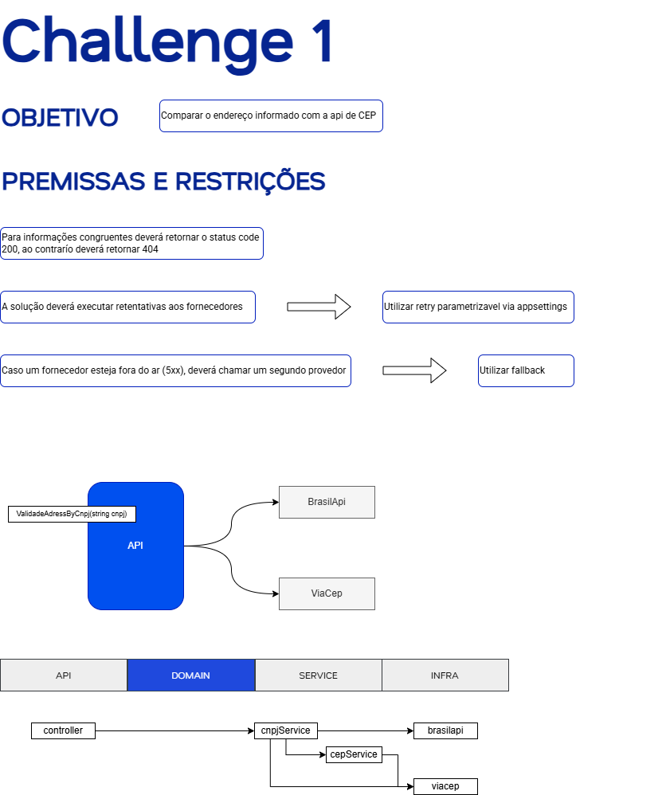
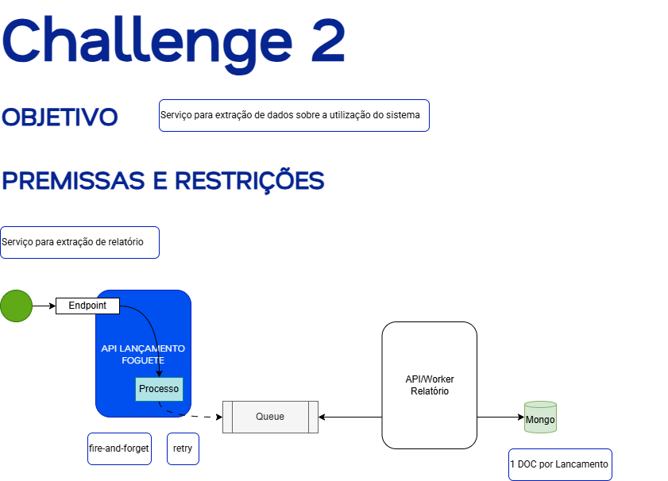
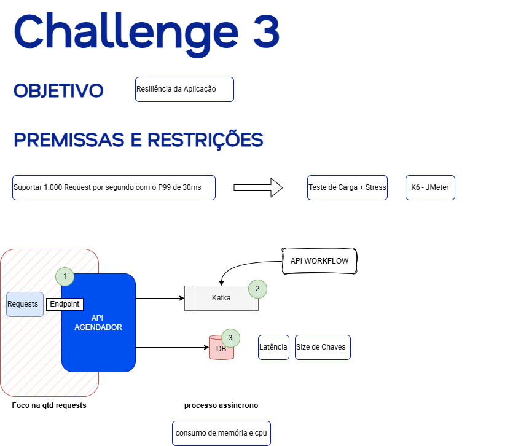

# 📘 Shipay - Desafio Back-end

Repositório que centraliza as respostas do desafio back-end proposta pela Shipay no repositório: https://github.com/shipay-pag/tech-challenges/blob/master/back_end/waimea/challenge.md

## 📑 Sumário dos Desafios
- [🔹 Desafio 01](#-desafio-01)
- [🔹 Desafio 02](#-desafio-02)
- [🔹 Desafio 03](#-desafio-03)
- [🔹 Desafio 05 – API de Gerenciamento de Usuários](#-desafio-05--api-de-gerenciamento-de-usuários)
- [🔹 Desafio 07](#-desafio-07)


# 🧩 Desafios

## 🔹 Desafio 01



## 🔹 Desafio 02



## 🔹 Desafio 03



## 🔹 Desafio 05

Desenvolvimento da API Rest para Gerenciamento de Usuários

### Descrição
- Criação de usuários com nome, email e role obrigatórios
- Geração automática de senha (se não fornecida)
- Hash seguro de senhas com bcrypt
- Validação de email com Pydantic
- Banco de dados em memória (dev) ou SQLite/PostgreSQL (production)

### Instalação

1. Clonar o repositório:
```bash
git clone https://github.com/mat-pereira/Shipay.git
cd Shipay
```

2. Criar o ambiente virtual
```bash
python -m venv .venv
.\.venv\Scripts\Activate.ps1
```

3. Instalar as dependências
```bash
pip install -r requirements.txt
```
4. Configurar as variáveis de ambiente
   Criar .env na raiz
```bash
ENVIRONMENT=local
DATABASE_URL=sqlite:///:memory:
PASSWORD_LENGTH=12
APP_VERSION=1.0.0
PROJECT_NAME=UserManagementAPI
```
5. Iniciar a API:
```bash
python -m uvicorn src.api.app:app --reload --host 127.0.0.1 --port 8000
```


### Endpoits

Executar o cadastro de um usuário com senha
```bash
curl -X 'POST' \
  'http://127.0.0.1:8000/users' \
  -H 'accept: application/json' \
  -H 'Content-Type: application/json' \
  -d '{"name":"João Silva","email":"joao@example.com","role_id":1,"password":"minhaSenha123"}'
```

Executar o cadastro de um usuário com geração automática de senha
```bash
curl -X 'POST' \
  'http://127.0.0.1:8000/users' \
  -H 'accept: application/json' \
  -H 'Content-Type: application/json' \
  -d '{"name":"Maria Santos","email":"maria@example.com","role_id":2}'
```

Executar o cadastro de um usuário com email que já existe
```bash
curl -X 'POST' \
  'http://127.0.0.1:8000/users' \
  -H 'accept: application/json' \
  -H 'Content-Type: application/json' \
  -d '{"name":"Maria Santos 2","email":"maria@example.com","role_id":2}'
```

Executar o cadastro de um usuário com role_id inexistente
```bash
curl -X 'POST' \
  'http://127.0.0.1:8000/users' \
  -H 'accept: application/json' \
  -H 'Content-Type: application/json' \
  -d '{"name":"João Neto","email":"joaoNeto@example.com","role_id":0,"password":"minhaSenha123"}'
```


#### Observações

- Ao iniciar a API, 3 roles são criadas automaticamente:
1. Admin
2. User
3. Manager

- Senhas hasheadas com bcrypt
- Email como chave única
- Validação de entrada com Pydantic
- Logs exibido no console, com seu respectivo nível de criticidade


## 🔹 Desafio 07


